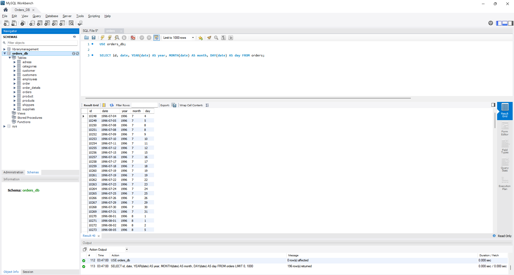
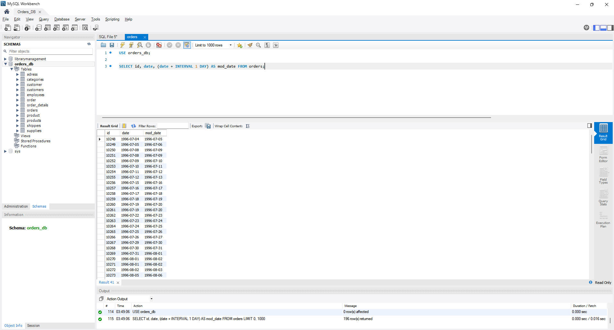
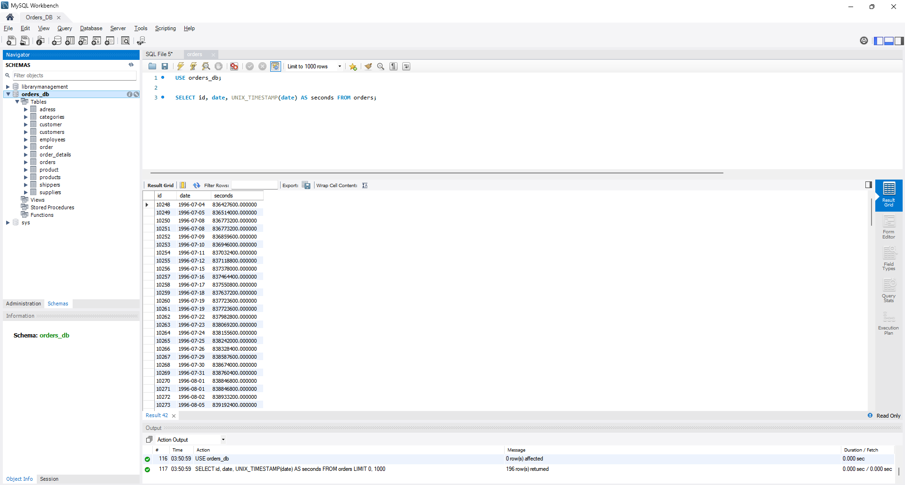
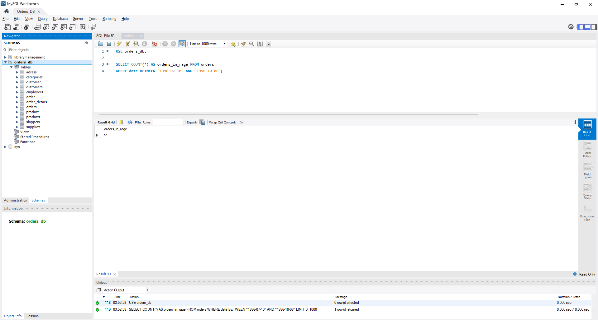
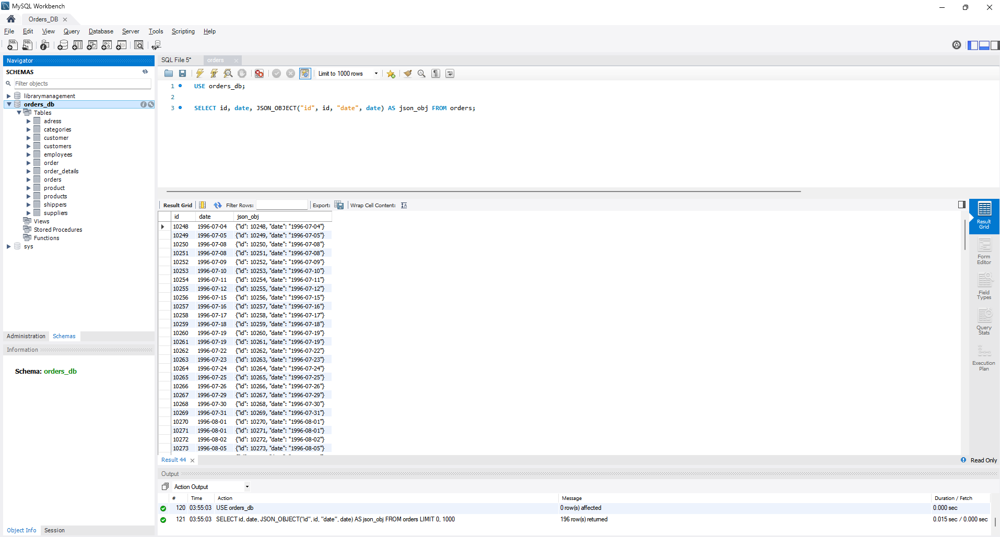

## Home task. Exploring Additional Built-in SQL Functions for Working with Time

#### Task Instructions

1. Write an SQL query that separates the year, month, and date from the `date` column in the `orders` table. Display them in three separate columns along with the `id` column and the original `date` column (there will be 5 columns in total).

2. Write an SQL query that adds one day to the `date` column in the `orders` table. Display the `id` column, the original `date` column, and the result of the addition on the screen.

3. Write an SQL query to show the number of seconds elapsed since the start of the countdown for the `orders` table, using the `date` attribute (displaying its timestamp value). To accomplish this, you'll need to locate and utilize the appropriate function. Present the `id` attribute, the original `date` attribute, and the function's result on the screen.

4. Write an SQL query to count the number of rows in the `orders` table where the `date` attribute falls between `1996-07-10 00:00:00` and `1996-10-08 00:00:00`.

5. Write an SQL query to retrieve the `id` attribute, the `date` attribute, and a JSON object containing these attributes in the format `{"id": <string id attribute>, "date": <string date attribute>}` from the `orders` table. Utilize a function to generate the JSON object.

